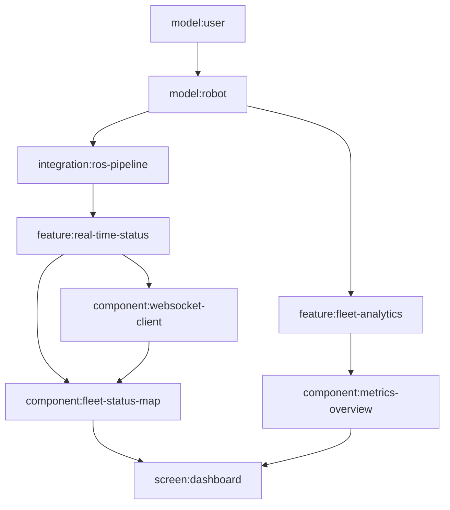

# Knowledge Map Schema Design

## Overview

This schema creates a systematic, CLI-parseable knowledge mapping format where entire projects are described through interconnected entities with formal relationships and lookup tables.

## Core Principles

1. **Entity-Relationship Model**: Everything is an entity with typed relationships
2. **Consistent Interlinking**: All references use formal IDs, no implicit relationships
3. **CLI Parseable**: Structure supports commands like `./cli screen dashboard | claude`
4. **Information Dense**: JSON for structure + plaintext for human descriptions
5. **MCP Sync Ready**: Format designed for Notion synchronization
6. **Zero Duplication**: All descriptions, strings, and content stored once with ID-based references

## Entity Types

### Required Fields (All Entities)
```json
{
  "id": "kebab-case-identifier",
  "type": "entity_type",
  "name": "Human Readable Name",
  "description": "Detailed plaintext description for humans",
  "meta": {
    "created": "ISO_date",
    "modified": "ISO_date",
    "version": "semver"
  }
}
```

### 1. Users
```json
"users": {
  "owner": {
    "id": "owner",
    "type": "user",
    "name": "Owner",
    "description": "Own one or more robots, employ and manage Operators",
    "access_level": "device_owner",
    "capabilities": ["assign_robots", "fleet_overview", "business_reports"],
    "screens": ["dashboard", "fleet-management", "business-reports"],
    "features": ["robot-assignment", "fleet-analytics", "predictive-maintenance"]
  }
}
```

### 2. Screens
```json
"screens": {
  "dashboard": {
    "id": "dashboard",
    "type": "screen",
    "name": "Fleet Dashboard",
    "description": "Main operational dashboard showing fleet status and key metrics",
    "route": "/dashboard",
    "layout": "main-layout",
    "components": ["fleet-status-map", "metrics-overview", "alert-panel"],
    "features": ["real-time-status", "fleet-analytics", "alert-system"],
    "user_access": ["owner", "operator", "fleet-teleoperator"],
    "requirements": ["real-time-updates", "responsive-design"]
  }
}
```

### 3. Components
```json
"components": {
  "fleet-status-map": {
    "id": "fleet-status-map",
    "type": "component",
    "name": "Fleet Status Map",
    "description": "Interactive map showing real-time robot locations and status",
    "framework": "react",
    "dependencies": ["leaflet", "websocket-client"],
    "props_interface": "FleetMapProps",
    "used_by_screens": ["dashboard", "fleet-management"],
    "implements_features": ["real-time-status", "location-tracking"],
    "models": ["robot", "location", "status"]
  }
}
```

### 4. Features
```json
"features": {
  "real-time-status": {
    "id": "real-time-status",
    "type": "feature",
    "name": "Real-Time Status Updates",
    "description": "Live updates of robot status with <10s latency",
    "priority": "P0",
    "version_introduced": "v1",
    "components": ["fleet-status-map", "status-indicator", "alert-panel"],
    "screens": ["dashboard", "fleet-management"],
    "requirements": ["websocket-connection", "real-time-updates"],
    "models": ["robot", "status", "telemetry"]
  }
}
```

### 5. Requirements
```json
"requirements": {
  "real-time-updates": {
    "id": "real-time-updates",
    "type": "requirement",
    "name": "Real-Time Updates",
    "description": "System must provide data updates with <10s latency for operational data",
    "priority": "P0",
    "type": "performance",
    "acceptance_criteria": "Data freshness < 10s for 95% of updates",
    "satisfied_by_features": ["real-time-status", "telemetry-streaming"],
    "impacts_components": ["websocket-client", "data-pipeline"]
  }
}
```

### 6. Models
```json
"models": {
  "robot": {
    "id": "robot",
    "type": "model",
    "name": "Robot",
    "description": "Core robot entity with operational data and status",
    "fields": {
      "id": "uuid",
      "serial_number": "string",
      "model_type": "enum",
      "status": "enum",
      "location": "coordinate",
      "battery_level": "number",
      "owner_id": "uuid"
    },
    "relationships": ["owner", "operator", "missions"],
    "used_by_features": ["fleet-management", "robot-control", "diagnostics"],
    "used_by_components": ["fleet-status-map", "robot-card", "diagnostics-panel"]
  }
}
```

### 7. Modules
```json
"modules": {
  "fleet-management": {
    "id": "fleet-management",
    "type": "module",
    "name": "Fleet Management",
    "description": "Core module handling fleet operations, status, and coordination",
    "components": ["fleet-status-map", "robot-card", "fleet-metrics"],
    "features": ["real-time-status", "fleet-analytics", "robot-assignment"],
    "dependencies": ["auth-module", "data-pipeline-module"],
    "api_endpoints": ["/api/fleet", "/api/robots", "/api/status"]
  }
}
```

### 8. Robot Types
```json
"robot_types": {
  "window-washing-drone": {
    "id": "window-washing-drone",
    "type": "robot_type",
    "name": "Window Washing Drone",
    "description": "Autonomous drone for commercial window cleaning operations",
    "deployment_status": "production",
    "current_fleet_size": 1000,
    "capabilities": ["window-cleaning", "autonomous-pathfinding", "obstacle-avoidance"],
    "sensors": ["lidar", "camera", "pressure-sensor", "battery-monitor"],
    "operating_environments": ["commercial-buildings", "high-rise", "outdoor"],
    "maintenance_schedule": "weekly",
    "safety_systems": ["emergency-landing", "geofencing", "collision-avoidance"]
  }
}
```

### 9. Missions
```json
"missions": {
  "window-cleaning-routine": {
    "id": "window-cleaning-routine",
    "type": "mission",
    "name": "Window Cleaning Routine",
    "description": "Standard window cleaning mission with waypoint navigation",
    "mission_type": "cleaning",
    "duration_estimate": "45-60 minutes",
    "robot_types": ["window-washing-drone"],
    "required_conditions": ["daylight", "wind-speed-lt-15mph", "no-precipitation"],
    "waypoint_planning": "click-and-clean",
    "safety_protocols": ["pre-flight-check", "weather-validation", "battery-minimum-30"],
    "completion_criteria": ["all-waypoints-visited", "cleaning-verified", "safe-landing"]
  }
}
```

### 10. AI Capabilities
```json
"ai_capabilities": {
  "edge-health-analysis": {
    "id": "edge-health-analysis",
    "type": "ai_capability",
    "name": "Edge-Based Health Analysis",
    "description": "On-device AI for component health monitoring and predictive maintenance",
    "processing_location": "edge",
    "version_introduced": "v1",
    "algorithms": ["anomaly-detection", "trend-analysis", "component-degradation"],
    "data_sources": ["sensor-telemetry", "motor-performance", "battery-metrics"],
    "outputs": ["health-score", "maintenance-alerts", "failure-predictions"],
    "accuracy_target": "85%",
    "latency_requirement": "<1s"
  }
}
```

### 11. Integration Points
```json
"integration_points": {
  "ros-command-pipeline": {
    "id": "ros-command-pipeline",
    "type": "integration_point",
    "name": "ROS Command Pipeline",
    "description": "Integration between cloud commands and robot edge systems via ROS",
    "protocol": "ros2",
    "transport": "iot-core-mqtt",
    "latency_requirement": "<200ms",
    "data_flow": "cloud → iot-core → edge-device → ros-nodes",
    "command_types": ["movement", "mission-control", "emergency-stop", "diagnostics"],
    "backward_compatibility": true,
    "security": ["tls-encryption", "device-certificates", "command-signing"]
  }
}
```

### 12. Deployment Environments
```json
"deployment_environments": {
  "commercial-building": {
    "id": "commercial-building", 
    "type": "deployment_environment",
    "name": "Commercial Building",
    "description": "Multi-story commercial buildings requiring window cleaning services",
    "characteristics": ["high-rise", "glass-facade", "urban-setting"],
    "operational_challenges": ["wind-exposure", "traffic-proximity", "regulatory-compliance"],
    "required_certifications": ["faa-part-107", "building-access-permits"],
    "safety_considerations": ["pedestrian-areas", "vehicle-traffic", "building-occupancy"],
    "typical_mission_duration": "2-4 hours",
    "robot_types": ["window-washing-drone"]
  }
}
```

## Relationship System

### Relationship Types
- `depends_on`: Entity requires another entity to function
- `contains`: Entity includes/owns another entity
- `uses`: Entity utilizes another entity
- `implements`: Entity provides functionality for another entity
- `accessed_by`: Entity is accessible to another entity

### Relationship Structure
```json
"relationships": {
  "screen:dashboard": {
    "contains": ["component:fleet-status-map", "component:metrics-overview"],
    "implements": ["feature:real-time-status"],
    "accessed_by": ["user:owner", "user:operator"],
    "depends_on": ["requirement:real-time-updates"]
  }
}
```

## Lookup Tables

### Structure
```json
"lookup_tables": {
  "by_user": {
    "owner": {
      "screens": ["dashboard", "fleet-management"],
      "features": ["robot-assignment", "fleet-analytics"],
      "components": ["fleet-status-map", "business-reports"]
    }
  },
  "by_feature": {
    "real-time-status": {
      "screens": ["dashboard", "fleet-management"],
      "components": ["fleet-status-map", "status-indicator"],
      "requirements": ["real-time-updates"],
      "models": ["robot", "status"]
    }
  }
}
```

## CLI Integration

### Command Patterns
```bash
# Entity Extraction
./cli screen dashboard          # Get dashboard + related components/features
./cli component fleet-map       # Get component + dependencies/usage
./cli feature real-time-status  # Get feature + implementing components/screens
./cli user owner               # Get user + accessible screens/features
./cli module fleet-management  # Get module + all contained entities

# Consistency Checking
./cli validate                  # Full system consistency check
./cli validate links            # Check all entity references are valid
./cli validate dependencies     # Check dependency chains and circular deps
./cli validate permissions      # Check user access patterns are consistent
./cli validate data-flow        # Check models → components → screens flow
./cli validate duplicates       # Find potential content duplication

# Analysis Commands
./cli analyze coverage          # Show uncovered features/requirements
./cli analyze orphans          # Find entities not referenced by others
./cli analyze complexity       # Identify overly complex dependency chains
./cli analyze deps             # Generate dependency map for implementation planning
./cli stats                    # Show entity counts and relationship metrics
```

### Output Format for Claude
```json
{
  "requested_entity": { /* full entity details */ },
  "related_entities": {
    "components": [ /* related components */ ],
    "features": [ /* related features */ ],
    "requirements": [ /* related requirements */ ],
    "models": [ /* related models */ ]
  },
  "context": {
    "dependencies": [ /* what this entity depends on */ ],
    "dependents": [ /* what depends on this entity */ ],
    "user_access": [ /* which users can access */ ]
  },
  "development_context": {
    "files_to_create": [ /* suggested file paths */ ],
    "existing_patterns": [ /* similar components/patterns */ ],
    "design_system": { /* relevant design tokens */ }
  }
}
```

## Deduplication Strategy

### Content References
Instead of repeating descriptions or long text:
```json
{
  "content_library": {
    "desc-001": "Real-time updates of robot status with <10s latency",
    "desc-002": "Interactive map showing live robot locations and status",
    "capability-001": "assign_robots_to_operators",
    "requirement-001": "Data freshness < 10s for 95% of updates"
  }
}
```

### Entity References
```json
{
  "screens": {
    "dashboard": {
      "id": "dashboard",
      "description_ref": "desc-002",
      "components": ["fleet-status-map", "metrics-overview"]
    }
  },
  "components": {
    "fleet-status-map": {
      "id": "fleet-status-map", 
      "description_ref": "desc-002"  // Same content, single source
    }
  }
}
```

### Capability/Feature Inheritance
```json
{
  "capability_sets": {
    "basic-operator": ["robot-control", "mission-reports", "device-health"],
    "advanced-operator": ["@basic-operator", "fleet-coordination", "teleoperation"]
  },
  "users": {
    "operator": {
      "capabilities_ref": "basic-operator"
    },
    "fleet-teleoperator": {
      "capabilities_ref": "advanced-operator" 
    }
  }
}
```

## Validation Rules & CLI Consistency Checking

### Core Validation Rules
1. **ID Uniqueness**: All entity IDs must be unique within their type
2. **Reference Integrity**: All relationship references must point to existing entities
3. **Content Reference Integrity**: All `*_ref` fields must point to existing content library entries
4. **Circular Dependencies**: Detect and prevent circular dependency chains
5. **Required Fields**: All entities must have required core fields
6. **Naming Convention**: IDs must be kebab-case, names must be Title Case
7. **Duplication Detection**: Flag identical descriptions across entities for consolidation

### CLI Validation Commands

#### `./cli validate links`
```json
{
  "validation_type": "link_integrity",
  "errors": [
    {
      "entity": "screen:dashboard",
      "field": "components",
      "invalid_reference": "non-existent-component",
      "message": "Component 'non-existent-component' referenced but not defined"
    }
  ],
  "warnings": [
    {
      "entity": "component:fleet-map",
      "field": "used_by_screens", 
      "message": "Component not referenced by any screen in forward direction"
    }
  ]
}
```

#### `./cli validate dependencies`
```json
{
  "validation_type": "dependency_analysis",
  "circular_dependencies": [
    {
      "cycle": ["module:auth → module:user-mgmt → module:permissions → module:auth"],
      "severity": "error"
    }
  ],
  "missing_dependencies": [
    {
      "entity": "component:data-grid",
      "missing": ["react-table"],
      "message": "Component declares react-table dependency but package not in dependencies"
    }
  ],
  "dependency_depth": {
    "max_depth": 6,
    "deepest_chain": "screen:dashboard → component:fleet-map → service:websocket → model:robot → db:postgres → infrastructure:aws"
  }
}
```

#### `./cli validate permissions`  
```json
{
  "validation_type": "access_control",
  "permission_conflicts": [
    {
      "user": "operator",
      "entity": "screen:admin-panel", 
      "conflict": "User has access to screen but not to required features",
      "missing_features": ["user-management", "system-settings"]
    }
  ],
  "orphaned_permissions": [
    {
      "entity": "feature:deprecated-reports",
      "issue": "Feature accessible by users but no screens implement it"
    }
  ]
}
```

#### `./cli validate data-flow`
```json
{
  "validation_type": "data_flow_integrity", 
  "broken_flows": [
    {
      "model": "telemetry-data",
      "components": ["status-indicator"],
      "screens": [],
      "issue": "Model used by components but components not used by any screens"
    }
  ],
  "unused_models": ["deprecated-mission-log", "old-user-preferences"],
  "model_usage_analysis": {
    "robot": {
      "components": 8,
      "features": 12, 
      "screens": 5,
      "health": "well_connected"
    }
  }
}
```

#### `./cli analyze coverage`
```json
{
  "analysis_type": "feature_coverage",
  "uncovered_requirements": [
    {
      "requirement": "offline-operation",
      "priority": "P1",
      "missing": "No features implement offline capability"
    }
  ],
  "unimplemented_features": [
    {
      "feature": "voice-commands",
      "screens": [],
      "components": [],
      "status": "planned_but_not_implemented"
    }
  ],
  "coverage_metrics": {
    "requirements_covered": "87%",
    "features_implemented": "94%",
    "screens_complete": "76%"
  }
}
```

#### `./cli analyze deps`
```json
{
  "analysis_type": "dependency_mapping",
  "implementation_order": {
    "phase_1_foundational": [
      {
        "entity": "model:user",
        "type": "model",
        "dependencies": [],
        "reason": "No dependencies, required by auth system"
      },
      {
        "entity": "model:robot",
        "type": "model", 
        "dependencies": ["model:user"],
        "reason": "Foundation for all robot operations"
      },
      {
        "entity": "integration:ros-command-pipeline",
        "type": "integration_point",
        "dependencies": ["model:robot"],
        "reason": "Core communication layer"
      }
    ],
    "phase_2_core_features": [
      {
        "entity": "feature:real-time-status",
        "type": "feature",
        "dependencies": ["model:robot", "integration:ros-command-pipeline"],
        "blocks": ["component:fleet-status-map", "screen:dashboard"],
        "reason": "Enables basic monitoring capabilities"
      },
      {
        "entity": "component:websocket-client",
        "type": "component", 
        "dependencies": ["feature:real-time-status"],
        "enables": ["real-time updates across system"],
        "reason": "Infrastructure for live updates"
      }
    ],
    "phase_3_user_interfaces": [
      {
        "entity": "component:fleet-status-map",
        "type": "component",
        "dependencies": ["feature:real-time-status", "component:websocket-client", "model:robot"],
        "enables": ["screen:dashboard", "screen:fleet-management"],
        "reason": "Core visualization component"
      },
      {
        "entity": "screen:dashboard", 
        "type": "screen",
        "dependencies": ["component:fleet-status-map", "component:metrics-overview"],
        "reason": "Primary user interface"
      }
    ]
  },
  "parallel_tracks": {
    "backend_track": ["models", "integrations", "apis", "data-pipeline"],
    "frontend_track": ["components", "screens", "user-flows"],
    "ai_track": ["ai-capabilities", "ml-models", "edge-processing"]
  },
  "critical_path": [
    "model:user",
    "model:robot", 
    "integration:ros-command-pipeline",
    "feature:real-time-status",
    "component:fleet-status-map",
    "screen:dashboard"
  ],
  "estimated_effort": {
    "phase_1": "2-3 sprints",
    "phase_2": "3-4 sprints", 
    "phase_3": "4-5 sprints"
  },
  "risk_factors": [
    {
      "entity": "integration:ros-command-pipeline",
      "risk": "Complex integration with existing ROS systems",
      "mitigation": "Prototype early, maintain backward compatibility"
    }
  ]
}
```

#### Dependency Visualization


### Automated Quality Checks
- **Reference Resolution**: Every entity reference must resolve to existing entity
- **Bidirectional Consistency**: If A references B, B should acknowledge A in reverse lookup
- **Access Pattern Validation**: User permissions must align with accessible features/screens
- **Version Consistency**: Features marked for specific versions must have compatible components
- **Content Library Usage**: Track which content_library entries are unused vs overused
- **Dependency Chain Analysis**: Identify implementation bottlenecks and parallel work opportunities

## Migration Strategy

1. Parse existing knowledge map structure
2. Extract implicit entities and relationships
3. Generate IDs for all entities
4. Build relationship mappings
5. Create lookup tables
6. Validate all references
7. Generate new structured format

This schema enables powerful queries like "show me everything a user can access" or "what needs to be built for this feature" while maintaining human readability and system consistency.